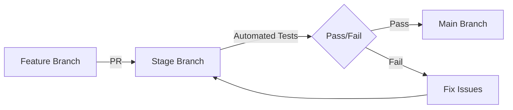
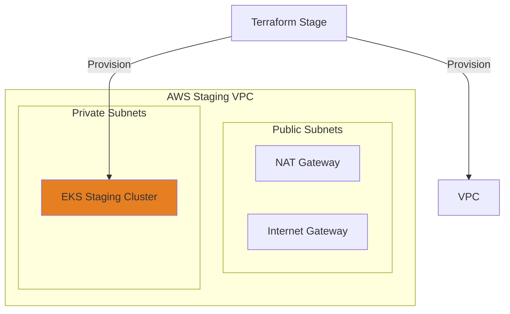

# 🧪 GitOps Staging Environment

<div align="center">


**Pre-Production Testing Ground for AWS EKS Infrastructure**

[Repository](https://github.com/Ammar-Abdelhady-ai/GitOps) • [Issues](https://github.com/Ammar-Abdelhady-ai/GitOps/issues) • [Wiki](https://github.com/Ammar-Abdelhady-ai/GitOps/wiki)

</div>

---

## 📋 Table of Contents

- [Overview](#-overview)
- [Staging Workflow](#-staging-workflow)
- [Architecture](#-architecture)
- [Technology Stack](#-technology-stack)
- [Prerequisites](#-prerequisites)
- [Quick Start](#-quick-start)
- [Infrastructure Components](#-infrastructure-components)
- [Testing Strategy](#-testing-strategy)
- [Resource Cleanup](#-resource-cleanup)
- [Troubleshooting](#-troubleshooting)
- [Contributing](#-contributing)
- [License](#-license)

---

## 🎯 Overview

This is the **Stage Branch** of the GitOps repository. It serves as the primary **validation environment** where infrastructure changes are tested before being promoted to production (`main` branch). The configuration here mirrors production but is isolated to prevent impact on live workloads.

### **Purpose of this Branch**

- **🔍 Validation**: Verify Terraform plans and applies in a safe environment
- **🧪 Testing**: Run integration tests on EKS clusters
- **🛡️ Quality Assurance**: Ensure security policies and network configs are correct
- **🔄 Staging**: Intermediate step in the GitOps workflow

---

## 🔄 Staging Workflow



1. **Feature Development**: Changes start in feature branches.
2. **Pull Request to Stage**: Code is merged into `stage` for testing.
3. **Automated Deployment**: GitHub Actions triggers infrastructure provisioning.
4. **Verification**: Manual or automated checks verify system health.
5. **Promotion**: Once validated, code is PR'd to `main`.

---

## 🏛️ Architecture

The staging architecture mimics production to ensure high fidelity testing.



---

## 🛠️ Technology Stack

| Category | Technology | Purpose |
|----------|-----------|---------|
| **IaC Tool** | Terraform ~> 1.10.3 | Infrastructure provisioning |
| **Cloud Provider** | AWS | Target cloud platform |
| **Orchestrator** | Amazon EKS | Managed Kubernetes (Staging Cluster) |
| **CI/CD** | GitHub Actions | Automated delivery pipeline |

---

## ✅ Prerequisites

Ensure you have the following tools installed to interact with the staging environment:

- **Terraform** >= 1.10.3
- **AWS CLI** >= 2.0
- **kubectl** >= 1.28
- **Git** >= 2.0

---

## 🚀 Quick Start

### **1. Clone and Checkout Stage**

```bash
git clone https://github.com/Ammar-Abdelhady-ai/GitOps.git
cd GitOps
git checkout stage
```

### **2. Initialize Terraform (Staging Backend)**

```bash
cd terraform/
terraform init \
  -backend-config="bucket=<staging-bucket-name>" \
  -backend-config="region=<your-region>" \
  -backend-config="key=stage/terraform.tfstate"
```

### **3. Review Staging Plan**

```bash
terraform plan -var="environment=stage"
```

### **4. Apply to Staging**

```bash
terraform apply -auto-approve -var="environment=stage"
```

---

## 🏗️ Infrastructure Components

The staging environment provisions:
- **VPC**: `10.0.0.0/16` (Default) or staging specific CIDR
- **EKS**: Single node group for cost efficiency (vs Multi-AZ in prod)
- **Security Groups**: Open for testing IP ranges

---

## 🧪 Testing Strategy

Before promoting to main, perform the following checks:

### **1. Syntax Validation**
```bash
terraform validate
```

### **2. Dry Run**
```bash
terraform plan
```

### **3. Cluster Health**
After apply, verify nodes are `Ready`:
```bash
kubectl get nodes
```

### **4. Workload Deployment**
Deploy sample app to ensure ingress/networking works:
```bash
kubectl create deployment nginx --image=nginx
```

---

## 🧹 Resource Cleanup

**Crucial**: Always destroy staging resources when testing is complete to save costs.

```bash
terraform destroy -auto-approve -var="environment=stage"
```

---

## 🤝 Contributing

1. Create a branch from `stage`.
2. Make your changes.
3. Open a PR against `stage`.
4. Ensure CI checks pass.

---

## 📄 License

This project is licensed under the MIT License.
