# 🚀 GitOps Infrastructure Automation Project

<div align="center">


**Enterprise-Grade Infrastructure as Code for AWS EKS Deployment**

[Repository](https://github.com/Ammar-Abdelhady-ai/GitOps) • [Issues](https://github.com/Ammar-Abdelhady-ai/GitOps/issues) • [Wiki](https://github.com/Ammar-Abdelhady-ai/GitOps/wiki)

</div>

---

## 📋 Table of Contents

- [Overview](#-overview)
- [Key Features](#-key-features)
- [Architecture](#-architecture)
- [Technology Stack](#-technology-stack)
- [Branch Strategy](#-branch-strategy)
- [Prerequisites](#-prerequisites)
- [Quick Start](#-quick-start)
- [Infrastructure Components](#-infrastructure-components)
- [Terraform State Management](#-terraform-state-management)
- [CI/CD Integration](#-cicd-integration)
- [Resource Cleanup](#-resource-cleanup)
- [GitHub Secrets Configuration](#-github-secrets-configuration)
- [Troubleshooting](#-troubleshooting)
- [Contributing](#-contributing)
- [License](#-license)

---

## 🎯 Overview

This repository demonstrates a **production-ready GitOps workflow** for managing cloud infrastructure using Infrastructure as Code (IaC) principles. The project showcases automated provisioning of AWS Virtual Private Cloud (VPC) and Amazon Elastic Kubernetes Service (EKS) clusters using Terraform, with Git as the single source of truth.

### **Project Highlights**

✨ **Infrastructure as Code**: Fully automated AWS infrastructure provisioning with Terraform
🔄 **GitOps Workflow**: Git-driven infrastructure deployment and version control
☁️ **Cloud-Native Architecture**: Production-grade EKS cluster with custom VPC configuration
🔐 **Secure by Design**: Private subnets, security groups, and IAM role management
📦 **Remote State Management**: S3 backend with DynamoDB state locking
🚀 **Multi-Environment Support**: Separate branches for development, staging, and production
🎛️ **Automated CI/CD**: GitHub Actions integration for infrastructure validation

---

## ✨ Key Features

- **🏗️ Complete VPC Setup**: Custom VPC with public/private subnets across multiple availability zones
- **⚙️ EKS Cluster Provisioning**: Fully managed Kubernetes cluster with node groups
- **🔒 Security Best Practices**: IAM roles, security groups, and network policies
- **📊 Infrastructure Observability**: Comprehensive outputs for resource verification
- **🔄 Idempotent Deployments**: Consistent infrastructure state management
- **🌐 Multi-AZ High Availability**: Fault-tolerant infrastructure across availability zones
- **📈 Scalable Architecture**: Auto-scaling node groups for dynamic workloads

---

## 🏛️ Architecture

```mermaid
graph TB
    subgraph "AWS Cloud"
        subgraph "VPC"
            subgraph "Public Subnets"
                NAT[NAT Gateway]
                IGW[Internet Gateway]
            end
            
            subgraph "Private Subnets - AZ1"
                EKS1[EKS Worker Nodes]
            end
            
            subgraph "Private Subnets - AZ2"
                EKS2[EKS Worker Nodes]
            end
            
            CP[EKS Control Plane]
        end
        
        S3[(S3 Bucket<br/>Terraform State)]
        DDB[(DynamoDB<br/>State Lock)]
    end
    
    Dev[Developer] -->|git push| GitHub[GitHub Repository]
    GitHub -->|GitHub Actions| TF[Terraform Apply]
    TF -->|Read/Write State| S3
    TF -->|State Locking| DDB
    TF -->|Provision| CP
    CP -->|Manage| EKS1
    CP -->|Manage| EKS2
    EKS1 & EKS2 -->|Internet Access| NAT
    NAT -->|Route| IGW
    
    style CP fill:#FF9900
    style S3 fill:#569A31
    style DDB fill:#527FFF
    style GitHub fill:#181717
```



### **Infrastructure Flow**

1. **Developer** pushes infrastructure code to GitHub repository
2. **GitHub Actions** validates Terraform configurations
3. **Terraform** provisions/updates AWS resources
4. **State Management** ensures consistent infrastructure state via S3/DynamoDB
5. **EKS Cluster** deployed across multiple availability zones for high availability

---

## 🛠️ Technology Stack

| Category | Technology | Purpose |
|----------|-----------|---------|
| **IaC Tool** | Terraform ~> 1.10.3 | Infrastructure provisioning and management |
| **Cloud Provider** | AWS | Cloud infrastructure platform |
| **Container Orchestration** | Amazon EKS | Managed Kubernetes service |
| **Networking** | AWS VPC | Virtual private cloud networking |
| **State Backend** | S3 + DynamoDB | Remote state storage and locking |
| **CI/CD** | GitHub Actions | Automated workflows and validation |
| **Version Control** | Git | Source code management |

---

## 🌿 Branch Strategy

This repository implements a **GitOps-driven** multi-branch strategy:

### **📌 Main Branch** (Current)
- **Purpose**: Production-ready infrastructure code
- **Content**: Terraform modules for VPC and EKS provisioning
- **Deployment**: Automated via approved pull requests
- **Protection**: Branch protection rules enabled

### **🧪 Stage Branch**
- **Purpose**: Pre-production testing and validation
- **Content**: Infrastructure configurations for staging environment
- **Workflow**: Testing ground before merging to main

### **🚀 Deployment Branch**
- **Purpose**: Application deployment configurations
- **Content**: Kubernetes manifests, Helm charts, Ansible playbooks, CI/CD pipelines
- **Technologies**: Docker, Kubernetes, Helm, Ansible, Jenkins, SonarQube

---

## ✅ Prerequisites

Before getting started, ensure you have the following tools installed:

- **Terraform** >= 1.10.3 ([Download](https://www.terraform.io/downloads.html))
- **AWS CLI** >= 2.0 ([Installation Guide](https://aws.amazon.com/cli/))
- **kubectl** >= 1.28 ([Installation Guide](https://kubernetes.io/docs/tasks/tools/))
- **Git** >= 2.0
- **AWS Account** with appropriate IAM permissions

### **Required AWS Permissions**

Your AWS user/role must have permissions to create:
- VPC, Subnets, Route Tables, Internet Gateways, NAT Gateways
- EKS Clusters, Node Groups
- IAM Roles and Policies
- Security Groups
- S3 Buckets (for state management)
- DynamoDB Tables (for state locking)

---

## 🚀 Quick Start

### **1. Clone the Repository**

```bash
git clone https://github.com/Ammar-Abdelhady-ai/GitOps.git
cd GitOps
```

### **2. Configure AWS Credentials**

```bash
aws configure
# Enter your AWS Access Key ID
# Enter your AWS Secret Access Key
# Enter your default region (e.g., us-east-2)
# Enter your preferred output format (json)
```

### **3. Initialize Terraform Backend**

```bash
cd terraform/

# Initialize with your S3 backend configuration
terraform init \
  -backend-config="bucket=<your-s3-bucket-name>" \
  -backend-config="region=<your-aws-region>" \
  -backend-config="key=terraform.tfstate"
```

> **Note**: Replace placeholders with your actual values

### **4. Review Infrastructure Plan**

```bash
terraform plan
```

### **5. Deploy Infrastructure**

```bash
terraform apply -auto-approve
```

### **6. Configure kubectl for EKS**

```bash
aws eks update-kubeconfig --region <region-name> --name <eks-cluster-name>
```

### **7. Verify Cluster Access**

```bash
kubectl get nodes
kubectl get namespaces
```

---

## 🏗️ Infrastructure Components

### **VPC Configuration**

The Terraform code provisions a complete VPC with:

- **CIDR Block**: Configurable IP range
- **Public Subnets**: For NAT Gateways and Load Balancers (2 AZs)
- **Private Subnets**: For EKS worker nodes (2 AZs)
- **Internet Gateway**: Public internet access
- **NAT Gateways**: Outbound internet for private subnets
- **Route Tables**: Public and private routing configurations
- **Security Groups**: Network security policies

### **EKS Cluster**

- **Kubernetes Version**: Latest stable version
- **Node Groups**: Auto-scaling worker nodes
- **Instance Types**: Configurable (t3.medium, t3.large, etc.)
- **Networking**: Uses VPC CNI plugin
- **Add-ons**: CoreDNS, kube-proxy, VPC CNI
- **IAM Integration**: IRSA (IAM Roles for Service Accounts)

### **Terraform Modules**

| File | Description |
|------|-------------|
| `main.tf` | Main Terraform configuration and provider setup |
| `vpc.tf` | VPC, subnets, gateways, and routing configuration |
| `eks-cluster.tf` | EKS cluster, node groups, and IAM roles |
| `variables.tf` | Input variables and defaults |
| `outputs.tf` | Output values for resource verification |
| `terraform.tf` | Terraform version and backend configuration |

---

## 💾 Terraform State Management

This project uses **remote state management** for collaboration and consistency.

### **Backend Configuration**

- **Storage**: AWS S3 bucket
- **Locking**: DynamoDB table for state locking
- **Encryption**: Server-side encryption enabled
- **Versioning**: S3 bucket versioning enabled for state recovery

### **State File Structure**

```
s3://<bucket-name>/terraform.tfstate
```

### **Benefits**

✅ **Team Collaboration**: Multiple developers can work safely  
✅ **State Locking**: Prevents concurrent modifications  
✅ **Disaster Recovery**: Version history for rollback  
✅ **Security**: Encrypted state files

> ⚠️ **Important**: Always back up your state file before destructive operations!

---

## 🔄 CI/CD Integration

### **GitHub Actions Workflow**

The repository includes GitHub Actions for automated infrastructure validation and deployment.

**Workflow Triggers:**
- Push to `main` branch
- Pull requests to `main` branch
- Manual workflow dispatch

**Workflow Steps:**
1. Checkout code
2. Configure AWS credentials
3. Initialize Terraform
4. Validate Terraform syntax
5. Plan infrastructure changes
6. Apply changes (on merge to main)

### **Branch Protection**

- **Required Reviews**: At least 1 approver
- **Status Checks**: Terraform validation must pass
- **Up-to-date**: Branch must be up-to-date before merging

---

## 🧹 Resource Cleanup

To avoid AWS charges, follow these steps to completely destroy all resources:

### **Step-by-Step Cleanup Guide**

#### **1. Remove Kubernetes Configuration**

```bash
rm -rf ~/.kube/config
```
- **Purpose**: Clears cached Kubernetes cluster configurations

#### **2. Update kubeconfig for EKS**

```bash
aws eks update-kubeconfig --region <region-name> --name <eks-cluster-name>
```
- **Purpose**: Reconnects to EKS cluster for resource cleanup

#### **3. Delete Ingress Controller (if installed)**

```bash
kubectl delete -f https://raw.githubusercontent.com/kubernetes/ingress-nginx/controller-v1.7.0/deploy/static/provider/aws/deploy.yaml
```
- **Purpose**: Removes NGINX ingress controller and associated load balancers

#### **4. Uninstall Helm Releases (if any)**

```bash
helm list --all-namespaces
helm uninstall <release-name> -n <namespace>
```
- **Purpose**: Removes all Helm-deployed applications

#### **5. Navigate to Terraform Directory**

```bash
cd terraform/
```

#### **6. Reinitialize Terraform**

```bash
terraform init \
  -backend-config="bucket=<s3-bucket-name>" \
  -backend-config="region=<region-name>" \
  -backend-config="key=terraform.tfstate"
```
- **Purpose**: Ensures Terraform can access the state file

#### **7. Destroy All Infrastructure**

```bash
terraform destroy -auto-approve
```
- **Purpose**: Deletes all Terraform-managed AWS resources

### **⚠️ Important Notes**

- **Backup State**: Save your state file before destruction
- **Review Resources**: Use `terraform plan -destroy` to preview deletions
- **Cost Savings**: Complete cleanup prevents unnecessary AWS charges
- **Data Loss**: This operation is irreversible!

---

## 🔐 GitHub Secrets Configuration

To enable GitHub Actions workflows, configure the following repository secrets:

| Secret Name | Description | Example |
|-------------|-------------|---------|
| `AWS_ACCESS_KEY_ID` | AWS IAM access key for authentication | `AKIAEXAMPLEID` |
| `AWS_SECRET_ACCESS_KEY` | AWS IAM secret key | `wJalrXUtnFEMI/K7MDENG/bPxRfiCY...` |
| `BUCKET_TF_STATE` | S3 bucket name for Terraform state | `my-terraform-state-bucket` |
| `REGISTRY` | AWS ECR registry URL (for deployment branch) | `123456789012.dkr.ecr.us-east-1.amazonaws.com` |
| `SONAR_ORGANIZATION` | SonarCloud organization (for deployment branch) | `my-org` |
| `SONAR_PROJECT_KEY` | SonarCloud project key (for deployment branch) | `vproapp0100` |
| `SONAR_TOKEN` | SonarCloud authentication token (for deployment branch) | `a12b34c56d78...` |
| `SONAR_URL` | SonarCloud URL (for deployment branch) | `https://sonarcloud.io` |

### **How to Add Secrets**

1. Navigate to your GitHub repository
2. Go to **Settings** → **Secrets and variables** → **Actions**
3. Click **New repository secret**
4. Enter the **Name** and **Value**
5. Click **Add secret**

📚 [GitHub Secrets Documentation](https://docs.github.com/en/actions/security-guides/encrypted-secrets)

---

## 🔧 Troubleshooting

### **Common Issues and Solutions**

<details>
<summary><b>Issue: Terraform state lock error</b></summary>

**Error**: `Error: Error acquiring the state lock`

**Solution**:
```bash
# Force unlock (use with caution!)
terraform force-unlock <lock-id>
```
</details>

<details>
<summary><b>Issue: AWS credentials not configured</b></summary>

**Error**: `No valid credential sources found`

**Solution**:
```bash
# Reconfigure AWS CLI
aws configure

# Or export credentials
export AWS_ACCESS_KEY_ID="your-key"
export AWS_SECRET_ACCESS_KEY="your-secret"
export AWS_DEFAULT_REGION="us-east-2"
```
</details>

<details>
<summary><b>Issue: EKS cluster unreachable</b></summary>

**Error**: `The connection to the server localhost:8080 was refused`

**Solution**:
```bash
# Update kubeconfig
aws eks update-kubeconfig --region <region> --name <cluster-name>

# Verify configuration
kubectl config view
```
</details>

<details>
<summary><b>Issue: Insufficient IAM permissions</b></summary>

**Error**: `UnauthorizedOperation` or `AccessDenied`

**Solution**:
- Verify your IAM user/role has necessary permissions
- Attach required policies: `AmazonEKSClusterPolicy`, `AmazonVPCFullAccess`
- Check AWS CloudTrail for detailed error logs
</details>

---

## 🤝 Contributing

Contributions are welcome! Please follow these guidelines:

1. **Fork** the repository
2. **Create** a feature branch (`git checkout -b feature/amazing-feature`)
3. **Commit** your changes (`git commit -m 'Add amazing feature'`)
4. **Push** to the branch (`git push origin feature/amazing-feature`)
5. **Open** a Pull Request

### **Code Standards**

- Follow Terraform best practices
- Run `terraform fmt` before committing
- Include meaningful commit messages
- Update documentation for new features

---

## 📄 License

This project is licensed under the MIT License - see the [LICENSE](LICENSE) file for details.

---

## 📞 Contact

**Ammar Abdelhady**

- GitHub: [@Ammar-Abdelhady-ai](https://github.com/Ammar-Abdelhady-ai)
- Repository: [GitOps](https://github.com/Ammar-Abdelhady-ai/GitOps)

---

<div align="center">

**Made with ❤️ for the DevOps Community**

⭐ Star this repository if you found it helpful!

</div>
